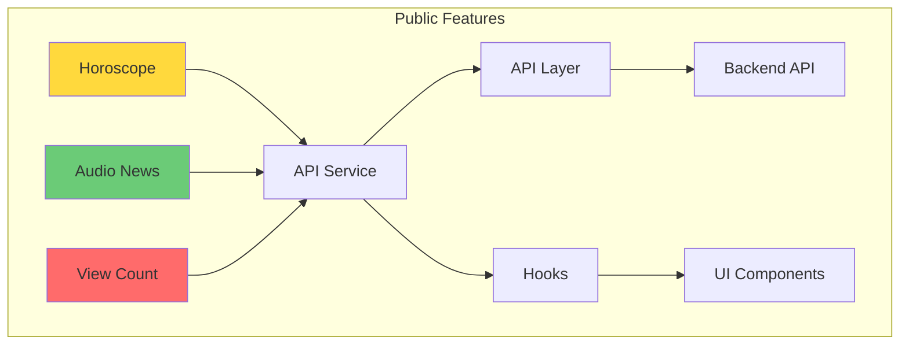

# Integration Plan: Public Features

## Executive Summary

The frontend already has implementations for all three requested features. This plan outlines the necessary updates to fully align with the API specifications.

---

## 1. Horoscope Integration

### Current Status

- **API Service**: [`src/lib/api/horoscopes.ts`](src/lib/api/horoscopes.ts:1) - Partial implementation
- **Hook**: [`src/hooks/useHoroscopes.ts`](src/hooks/useHoroscopes.ts:1) - Ready
- **UI**: [`src/components/horoscopes/HoroscopeSection.tsx`](src/components/horoscopes/HoroscopeSection.tsx:1) - Complete

### API Specification

| Parameter  | Type   | Required | Description                    |
| ---------- | ------ | -------- | ------------------------------ |
| limit      | number | No       | Default: 12                    |
| page       | number | No       | Default: 1                     |
| zodiacSign | string | No       | Filter by specific zodiac sign |

### Required Changes

```typescript
// src/lib/api/horoscopes.ts - Update HoroscopeParams
export interface HoroscopeParams {
  date?: string;
  zodiacSign?: string; // ADD THIS
  limit?: number; // ADD THIS
  page?: number; // ADD THIS
}

export function getHoroscopes(
  params?: HoroscopeParams,
): Promise<ApiResponse<Horoscope[]>> {
  const query = new URLSearchParams();
  if (params?.date) query.set("date", params.date);
  if (params?.zodiacSign) query.set("zodiacSign", params.zodiacSign); // ADD
  if (params?.limit) query.set("limit", String(params.limit)); // ADD
  if (params?.page) query.set("page", String(params.page)); // ADD

  const qs = query.toString();
  const endpoint = `/api/horoscopes${qs ? `?${qs}` : ""}`;
  return apiFetch<Horoscope[]>(endpoint, { method: "GET" });
}
```

### Implementation Steps

1. Add `zodiacSign`, `limit`, and `page` parameters to `HoroscopeParams` interface
2. Update `getHoroscopes` function to handle these parameters
3. Update `useHoroscopes` hook to pass parameters through
4. Optionally enhance UI to show filtered results when zodiacSign is selected

---

## 2. Audio News Integration

### Current Status

- **API Service**: [`src/lib/api/audio-news.ts`](src/lib/api/audio-news.ts:1) - Partial implementation
- **Hook**: [`src/hooks/useAudioNews.ts`](src/hooks/useAudioNews.ts:1) - Ready
- **UI**: [`src/components/audio/AudioNewsList.tsx`](src/components/audio/AudioNewsList.tsx:1) and [`AudioNewsPlayer.tsx`](src/components/audio/AudioNewsPlayer.tsx:1) - Complete

### API Specification

| Parameter  | Type   | Required | Description                     |
| ---------- | ------ | -------- | ------------------------------- |
| limit      | number | No       | Default: 10                     |
| page       | number | No       | Default: 1                      |
| categoryId | string | No       | Filter by category              |
| search     | string | No       | Search in title and description |

### Required Changes

```typescript
// src/lib/api/audio-news.ts - Update AudioNewsListParams
export interface AudioNewsListParams {
  page?: number;
  limit?: number;
  categoryId?: string;
  search?: string; // ADD THIS
}

export function getAudioNewsList(
  params?: AudioNewsListParams,
): Promise<ApiResponse<AudioNews[]>> {
  const query = new URLSearchParams();
  if (params?.page) query.set("page", String(params.page));
  if (params?.limit) query.set("limit", String(params.limit));
  if (params?.categoryId) query.set("categoryId", params.categoryId);
  if (params?.search) query.set("search", params.search); // ADD

  const qs = query.toString();
  const endpoint = `/api/audio-news${qs ? `?${qs}` : ""}`;
  return apiFetch<AudioNews[]>(endpoint, { method: "GET" });
}
```

### Implementation Steps

1. Add `search` parameter to `AudioNewsListParams` interface
2. Update `getAudioNewsList` function to handle search parameter
3. Create a search input component for Audio News section (optional enhancement)

---

## 3. Article View Count Integration

### Current Status

- **API Service**: [`src/lib/api/articles.ts`](src/lib/api/articles.ts:35) - **BUG: Wrong endpoint path**
- **Hook**: [`src/hooks/useArticleView.ts`](src/hooks/useArticleView.ts:1) - Complete
- **UI**: [`src/components/article/ArticleViewTracker.tsx`](src/components/article/ArticleViewTracker.tsx:1) - Complete

### Issue Identified

Current implementation in [`src/lib/api/articles.ts:35-41`](src/lib/api/articles.ts:35):

```typescript
export async function incrementView(slug: string): Promise<void> {
  try {
    await apiFetch<null>(`/articles/${slug}/view`, { method: "POST" }); // BUG: Missing /api prefix
  } catch {
    // fire and forget
  }
}
```

Also in [`src/hooks/useArticleView.ts:38`](src/hooks/useArticleView.ts:38):

```typescript
await apiFetch(`/articles/${slug}/view`, {
  // BUG: Missing /api prefix
  method: "POST",
});
```

### API Specification

| Endpoint                    | Method | Description          |
| --------------------------- | ------ | -------------------- |
| `/api/articles/{slug}/view` | POST   | Increment view count |

### Required Changes

```typescript
// src/lib/api/articles.ts - Fix endpoint path
export async function incrementView(slug: string): Promise<void> {
  try {
    await apiFetch<null>(`/api/articles/${slug}/view`, { method: "POST" }); // FIX: Add /api prefix
  } catch {
    // fire and forget
  }
}
```

```typescript
// src/hooks/useArticleView.ts:38 - Fix endpoint path
const trackView = async () => {
  try {
    await apiFetch(`/api/articles/${slug}/view`, {
      // FIX: Add /api prefix
      method: "POST",
    });
    markArticleAsViewed(slug);
    hasTrackedRef.current = true;
  } catch (error) {
    console.error("Failed to track article view:", error);
  }
};
```

### Implementation Steps

1. Fix `/articles/` → `/api/articles/` in [`src/lib/api/articles.ts:37`](src/lib/api/articles.ts:37)
2. Fix `/articles/` → `/api/articles/` in [`src/hooks/useArticleView.ts:38`](src/hooks/useArticleView.ts:38)
3. Test the view count increment functionality

---

## Summary

| Feature           | Priority | Files to Modify                                          | Status      |
| ----------------- | -------- | -------------------------------------------------------- | ----------- |
| View Count Fix    | HIGH     | `src/lib/api/articles.ts`, `src/hooks/useArticleView.ts` | Bug fix     |
| Audio News Search | MEDIUM   | `src/lib/api/audio-news.ts`                              | Enhancement |
| Horoscope Filter  | LOW      | `src/lib/api/horoscopes.ts`                              | Enhancement |

---

## Recommended Execution Order

1. **Fix View Count** - This is a critical bug that prevents view tracking
2. **Add Audio News Search** - Adds search functionality to existing UI
3. **Add Horoscope Filter** - Adds filtering capability to existing UI

---

## Architecture Diagram



- **Red**: High priority bug fix
- **Yellow**: Medium priority enhancement
- **Green**: Low priority enhancement
