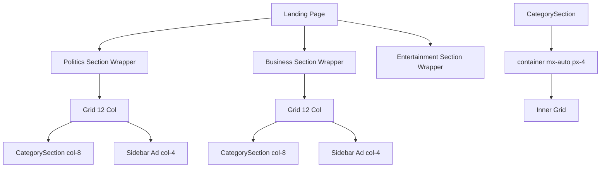
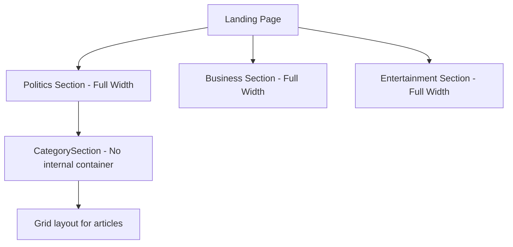

# Landing Page Fix Plan

## Issues Identified

### 1. Inconsistent Padding in Category Sections
**Root Cause:** The `CategorySection` component uses its own internal `container mx-auto px-4` wrapper, which creates a double-containment issue when used in the landing page grid layout.

**Current Structure:**
- Landing page wraps each category in a `grid grid-cols-1 lg:grid-cols-12` with gap
- `CategorySection` internally has `container mx-auto px-4` - this adds extra padding
- This causes misalignment between category sections and other sections

**Solution:** Remove the internal container from `CategorySection` so it uses the parent's container, OR make all category sections consistently use full-width layout without sidebar ads.

### 2. Unwanted Sidebar Ads in Category Sections
**Root Cause:** The landing page (`src/app/page.tsx`) displays `SectionSidebarAd` components alongside each category section (Politics, Business, Entertainment, Technology, World).

**Current Code (lines 167-249 in page.tsx):**
```tsx
// Each category has a sidebar ad
<div className="grid grid-cols-1 lg:grid-cols-12 gap-6">
  <div className="lg:col-span-8">
    <CategorySection ... />
  </div>
  <div className="lg:col-span-4">
    <SectionSidebarAd ... />
  </div>
</div>
```

**Solution:** Remove the sidebar ad columns from all category section wrappers.

---

## Actionable Steps

### Step 1: Fix Padding Consistency
- [ ] Modify `CategorySection.tsx` to remove the internal `container mx-auto px-4` wrapper and use full-width layout
- [ ] OR wrap each category section properly in the parent page with consistent container

### Step 2: Remove Sidebar Ads from Category Sections
- [ ] Remove the `SectionSidebarAd` components from lines 175-178 (Politics)
- [ ] Remove the `SectionSidebarAd` components from lines 195-197 (Business)
- [ ] Remove the `SectionSidebarAd` components from lines 210-212 (Entertainment)
- [ ] Remove the `SectionSidebarAd` components from lines 230-232 (Technology)
- [ ] Remove the `SectionSidebarAd` components from lines 245-247 (World)
- [ ] Change grid layout from `lg:grid-cols-12` to full-width for each category section

### Step 3: Update Category Section Layout
- [ ] Make `CategorySection` use full-width layout (remove grid col-span wrapper)
- [ ] Ensure consistent padding/margins with other sections on the page

### Step 4: Verify Category Page Has No Sidebar Ads
- [ ] Confirm that `src/app/category/[slug]/page.tsx` doesn't have sidebar ads (already verified - it doesn't have them)

---

## Files to Modify

1. `src/app/page.tsx` - Remove sidebar ads and update grid layout for category sections
2. `src/components/sections/CategorySection.tsx` - Fix internal container/padding structure

---

## Mermaid Diagram - Current vs Fixed Structure

### Current Structure (Problematic)


### Fixed Structure

